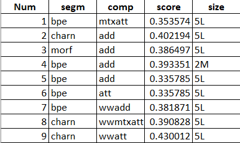

# Subword-informed word representation training framework
Yi Zhu et al. provide a general framework for training subword-informed word representations by varying the following components: 
- [subword segmentation methods](#subword-segmentation-methods);
- [subword embeddings and position embeddings](#subword-embeddings-and-position-embeddings);
- composition functions;

For the whole framework architecture and more details, please refer to the [reference](#references).

There are 4 segmentation methods, 3 possible ways of embedding subwords, 3 ways of enhancing with position embeddings, and 3 different composition functions.

Here is a full table of different options and their labels:

| Component | Option| Label |
|---|---|---|
| Segmentation methods 	| CHIPMUNK   Morfessor   BPE   Character n-gram| *sms*   *morf*   *bpe*   *charn*| 
| Subword embeddings 	| w/o word token   w/ word token   w/ morphotactic tag (only for *sms*)| -   *ww*   *wp*| 
| Position embeddings 	| w/o position embedding   addition   elementwise multiplication| -   *pp* (not applicable to *wp*)   *mp* (not applicable to *wp*)| 
| Composition functions | addition   single self-attention   multi-head self-attention| *add*   *att*   *mtxatt*| 

For example, *sms.wwppmtxatt* means they use CHIPMUNK as segmentation, insert word token into the subword sequence, enhance with additive position embedding, and use multi-head self-attention as composition function.

## Subword segmentation methods
Taking the word *dishonestly* as an example, with different segmentation methods, the word will be segmented into the following subword sequence:
- [ChipMunk](http://cistern.cis.lmu.de/chipmunk):  (*<dis*,  *honest*, *ly>*) + (*PREFIX*,  *ROOT*, *SUFFIX*) - *Supervised segmentation*
- [Morfessor](https://morfessor.readthedocs.io/en/latest/index.html): (*<dishonest*, *ly>*) - *Unsupervised segmentation*
- [BPE](https://github.com/bheinzerling/bpemb) (10k merge ops): (*<dish*, *on*, *est*, *ly>*) - *Unsupervised segmentation*
- [Character n-gram](https://aclweb.org/anthology/Q17-1010) (from 3 to 6): (*<di*, *dis*, ... , *ly>*, *<dis*, ... ,*tly>*, *<dish*, ... , *stly>*, *<disho*, ... , *estly>*) - *Unsupervised segmentation*

where *<* and *>* are word start and end markers.

After the segmentation, we will obtain a subword sequence S for each segmentation method, and another morphortactic tag sequence T for *sms*.

## Subword embeddings and position embeddings
We can embed the subword sequence S directly into subword embedding sequence by looking up in the subword embedding matrix, or insert a word token (*ww*) into S before embedding, i.e. for *sms* it will be (*<dis*, *honest*, *ly>*,  *\<dishonestly\>*).

Then we can enhance the subword embeddings with additive (*pp*) or elementwise (*mp*) multiplication.

For *sms*, we can also embed the concatenation of the subword and its morphortactic tags (*wp*): (*<dis:PREFIX*, *honest:ROOT*, *ly>*:*SUFFIX*). And *\<dishonest\>:WORD* will be inserted if we choose *ww*. Note that position embeddings are not applicable to *wp* as a kind of *morphological position* information has already been provided.

## Changes done for Gujarati Language

### Data Download
Data is obtained from [IndicCorp Monolingual corpus](https://ai4bharat.iitm.ac.in/corpora) from [here](https://ai4b-my.sharepoint.com/:u:/g/personal/sumanthdoddapaneni_ai4bharat_org/EawfDxTNnYZFvmH_Gzcc-PsB1EhVUrj-yPfdFSvc8zrOaA?e=wpe4iS&download=1). They have scrapped the data from multiple sources like news, magazines, books, etc.
The data consists of 41M sentences and around 719M sentences. I create a vocabulary of 157898 words which occured more than 100 times in the corpus.
This vocabulary can be found in `toy_data/gu/gu.sent.1m.5.word`. I couldn't train the model on 
entire data because of lack of resources. I tested my models on a subset of 5L sentences.
  
The data was preprocessed to remove punctuations and normalize the text. The code for that can be found in `code\preprocess.ipynb` and `code\preprocess_2.ipynb` notebooks.
### Segmentation

Specialized files were needed to run different segmentation methods.

#### BPE
A BPE trained embedding model was needed for our language. This was obtained from [here](https://github.com/bheinzerling/bpemb) and can be found at `toy_data/gu/gu.wiki.bpe.vs10000.model` in this repo. 

#### Morfessor
A model was trained for getting the morfessor embeddings following the instruction
found [here](https://morfessor.readthedocs.io/en/latest/cmdtools.html#morfessor). 
The resulting segments were processed and saved at the file `toy_data/gu/gu.sent.1m.5.morf`

#### Character N-grams
The segments were directly prepared as the language model was trained.

#### Chipmunk
I didn't have a supervised data for Gujarati for this segmentation and this wasn't prepared.

### Training
The models were trained by running `./run.sh gu SEGM_METH COMP_FUNC LR BS`
where `SEGM_METHOD` is the segmentation method(can be `bpe`, `morf`, `charn`). 
`COMP_FUNC` is the function used for composition mentioned in the table above.
It can be `add`, `att`, `mtxatt`. Postion embedding information can be mentioned here as well. `wwppatt` would mean subword embedding with word(`ww`), with addition of postion embeddings(`pp`) and single self-attention(`att`) as a composition function.
`LR` is the learning rate. `BS` is the batch-size. An example of the train configurations can be seen as follows:
  
`./run.sh gu bpe add 0.01 1000`

### Evaluation
Models were evaluated on a word-similarity task. In this task, model predicted embeddings are used to find the similarity between two words and this similarity is compared with rated similarity.
These word pairs are previously labelled for their similarity scores. The labelled data for Gujarati word similarity task was obtained from [here](https://github.com/syedsarfarazakhtar/Word-Similarity-Datasets-for-Indian-Languages/blob/master/Gujarati-WS.txt). This dataset needs correction and I am focussing on that as of now.
A cosine similarity was measured between the word embeddings and scaled to 10 as our model predicted thresholds.
  
The code for evaluating these models can be found in `code/evaulate.ipynb` notebook.

### Results
Results of some of the models can be seen as follows: 

## References
- [A Systematic Study of Leveraging Subword Information for Learning Word Representations.](https://arxiv.org/abs/1904.07994) Yi Zhu, Ivan Vulić, and Anna Korhonen. In Proc. of NAACL 2019.

